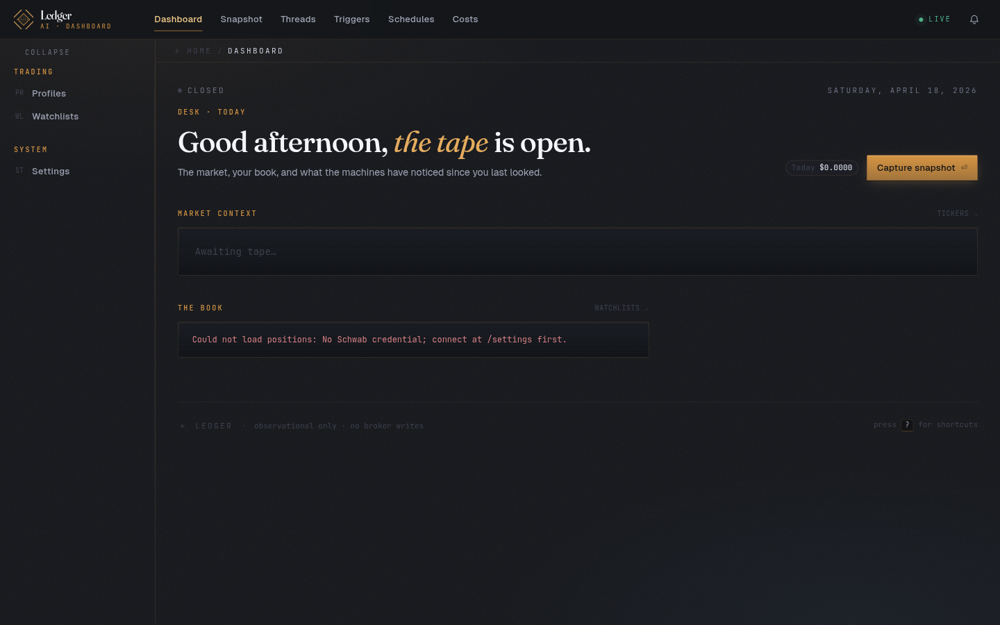
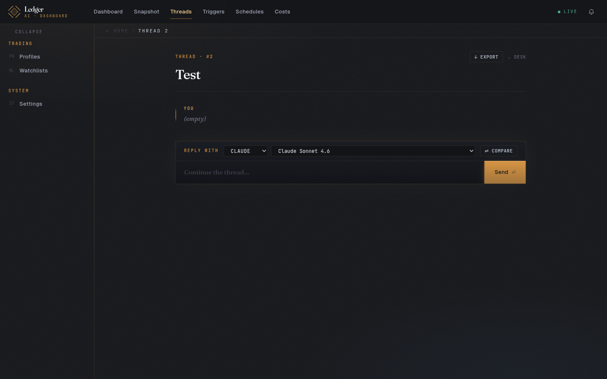
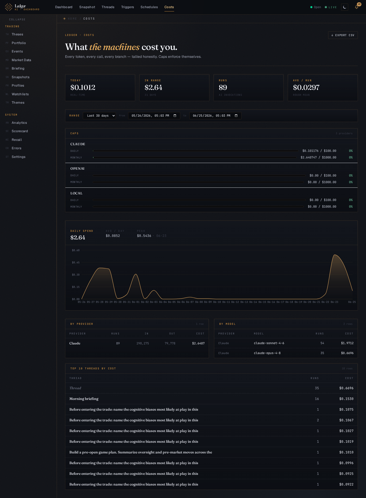

# Ledger

A single-user desktop dashboard that captures point-in-time **stock-market snapshots** (quotes, OHLC, option chains, positions, market breadth, news, rendered charts) and routes them to an AI — **Claude**, **OpenAI**, or a **local OpenAI-compatible endpoint** — for observations framed by a named trading style and a per-snapshot objective. It then closes the loop: record the decision you made, and let a scheduled post-mortem grade it against the tape.

**Observational only.** No broker write path — Ledger reads the market and reasons about it; it never places or modifies an order. Runs entirely in Docker Compose and binds to `127.0.0.1`.

- 🔁 **Closes the loop:** theses → deterministic post-mortems → a track record that's fed back into every new analysis via the Decision Coach.
- 🧠 **Bring your own AI:** Claude, OpenAI, or any local OpenAI-compatible model — compare them side-by-side, and *measure* which is actually right with a look-ahead-safe eval harness.
- 🔒 **Local & private:** runs in Docker on `127.0.0.1`, encrypted keys, no telemetry, no broker write path.

> 📋 **[Full feature tour →](FEATURES.md)** · Full design: [`docs/superpowers/specs/2026-04-16-ai-dashboard-design.md`](docs/superpowers/specs/2026-04-16-ai-dashboard-design.md) · Contributor guide: [`CLAUDE.md`](CLAUDE.md)

## Screenshots

**Dashboard** — the daily overview ("the tape").



**Threads** — pick a provider and model, or fan the same prompt across several at once with Compare.



**Costs** — every token, every model, every thread, with daily/monthly caps and CSV export.



## Status

**Feature-complete — fifteen milestones shipped (M1 → M15).** The newest addition is the **M15 Strategist** — an append-only market-regime read, a daily whole-book risk X-ray, a multi-agent war-room debate, and an agentic anomaly-sweep desk.

| Milestone | Scope | Tag |
|---|---|---|
| M1 | Compose skeleton | `m1-skeleton` |
| M2 | Market data (Schwab) | `m2-market-data` |
| M3 | Snapshots + AI routing | `m3-snapshots-ai` |
| M4 | Threads + streaming + compare | `m4-full-threads` |
| M5 | Option chains, news, chart images | `m5-chains-news-images` |
| M6 | Observer (scheduled AI runs) | `m6-observer` |
| M7 | Event triggers + condition DSL | `m7-event-triggers` |
| M8 | Polish (layout, cost caps, backups, export) | `m8-polish` |
| M9 | AI platform v2 (tool use, extended thinking, memory) | `m9-ai-platform-v2` |
| M10 | AI platform v2.5 (files, citations, structured, batch) | `m10-ai-platform-v25` |
| M11 | Second brain (theses, post-mortems, decision journal) | — |
| M12 | Analytics (leaderboard, heatmap, unusual options) | `m12-analytics` |
| M13 | Prediction Ledger (the AI's own auto-graded forecasts) | — |
| M14 | Resident Analyst (autonomous investigation, calibration routing, COVERAGE, The Mirror) | — |
| M15 | Strategist (market regime · book risk X-ray · war room · desk) | — |

> M11–M15 merged without release tags. Several capabilities ship untagged: **free data sources** (run with no brokerage login), **provider tool parity** (tool use on all three providers, with visible capability warnings), a **Decision Coach** that feeds prior theses / snapshot diffs / your track record / setup-cohort base rates / distilled lessons / measured eval calibration / semantic recall into the prompt, the **Prediction Ledger** (the AI's own auto-graded calls), the **Resident Analyst** (autonomous investigations + calibration-weighted routing + The Mirror), **semantic recall**, a daily **Morning Briefing**, a **forward earnings + macro calendar**, **overnight (pre-market) snapshots**, and a **calibration scorecard**. All of M14 has shipped, including **F3 COVERAGE** — a living, version-controlled per-ticker house view the AI revises with a reason. The **M15 Strategist** layer then adds an append-only market-regime reading, a daily whole-book risk X-ray, a multi-agent "war room" debate that streams over a thread, and an agentic anomaly-sweep desk.

## Features

> Looking for the elevator pitch? See the **[feature tour in `FEATURES.md`](FEATURES.md)**. The sections below are the detailed technical breakdown.

### Market data & snapshots

- **Snapshots** — capture a point-in-time market picture from opt-in sections: real-time **quotes**, **OHLC** history, **option chains**, **positions**, **market breadth**, **news**, **macro indicators** (FRED), **SEC filings** (EDGAR + Form 4 insider), **Treasury rates**, **rendered chart images** (headless-Chromium PNGs), and the **events** forward calendar. A section that fails is marked `failed` and explicitly flagged in the AI payload — partial captures are fine, never silently dropped.
- **Overnight (pre-market) snapshots** — an opt-in capture mode that adds index/vol/rates **futures**, overseas quotes, extended-hours OHLC, and overnight news (since the prior close), with per-ticker `gap_pct` vs. `prior_close`. Toggle it with the *Overnight* checkbox in the snapshot composer.
- **Forward calendar** — upcoming **earnings** (per-ticker, BMO/AMC hints + EPS estimates via Finnhub) and curated US **macro** events (FOMC / CPI / NFP / PCE / GDP). Surfaced three ways: the opt-in `events` snapshot section, the `days_to_earnings` trigger leaf, and `GET /api/market/events/?tickers=…&within_days=14`. Refreshed daily by the `market.refresh_events` beat task; macro degrades to a seeded list when Finnhub's economic calendar is unavailable.
- **Free data sources alongside Schwab** — beyond the Schwab integration, the backend ships free-tier / keyless clients for **Alpaca** (real-time IEX quotes + bars), **Tiingo**, **Twelve Data**, **Polygon** (price history), **Tradier** (delayed option chains), **FRED** (macro + the daily Treasury yield curve), **SEC EDGAR** (filings + Form 4 insider), **Marketaux** (news + per-ticker sentiment), and **US Treasury** FiscalData. Drop a key into **Settings → Connections** and the quotes / OHLC / option-chain / news pipeline transparently falls back to a free provider when Schwab isn't connected — so the whole dashboard runs without a brokerage login. `macro`, `filings`, and `treasury` are new opt-in snapshot sections.
- **Watchlists** — group tickers and drill into a per-ticker market page.
- **Objective + profile framing** — every capture carries a free-text objective and a named trading-style profile, so the model knows *how* to look and *what* you're asking.
- **Token budgeting** — the payload is trimmed to a per-model budget (from the model catalog) before it reaches the LLM; per-section token counts are recorded for the cost drill-down.
- **Snapshot diff** — `GET /api/snapshots/<id>/diff/?against=<id>` returns a markdown delta between two captures.

### AI providers & routing

- **Three backends** — Claude (Anthropic SDK), OpenAI, and any local OpenAI-compatible endpoint. A normalized event stream (`text_delta | image_ref | usage | done | error`) keeps the rest of the app provider-agnostic.
- **Router with precedence** — provider/model selection flows through a single router + factory; providers are never instantiated ad-hoc from views or tasks.
- **Model catalog** — per-model pricing and max payload budgets drive both cost calculation and payload trimming.
- **Trading-style profiles** — reusable personas (system framing) that also toggle the advanced capabilities below.

### Threads & streaming

- **Live token streaming** over WebSockets (`thread.<id>`): full message lifecycle plus `text_delta` and post-completion `cost` events.
- **Multi-provider compare** — `POST /api/threads/<id>/compare` fans the same prompt across multiple provider+model pairs in parallel, each streaming into its own branch tab.
- **Stop** — aborts the upstream generation *and* billing (closes the provider stream), not just the final write.
- **Pinned snapshots** — a captured snapshot is injected as the thread's first turn, so the model (and you) can see exactly what it was given.

### Advanced AI capabilities (opt-in per profile)

- **Tool use** — an agentic tool loop backed by a pluggable tool registry; every call is recorded and streamed (`tool_call` / `tool_result`). **Works on all three providers** — Claude always, and OpenAI/local when the credential opts in (`ProviderConfig.supports_tools`, on by default; turn it off for local endpoints without function-calling).
- **Extended thinking** *(Claude)* — budgeted reasoning with `thinking_delta` events (billed as output tokens).
- **Memory** *(Claude)* — the `memory_20250818` tool, scoped to a per-profile directory under `/data/memory/<profile_id>/`.
- **Files** *(Claude)* — upload documents through the Anthropic Files API and attach them to a thread.
- **Citations** *(Claude)* — news items are sent as Anthropic `search_result` blocks; the UI resolves citations back to their source.
- **Prompt caching** *(Claude)* — multi-turn runs cache the prior message for ~0.1× input cost on a hit.
- **Structured observations** *(Claude)* — observer runs can return a typed `ObservationReport` for structured UI cards.

> **Capability warnings, not silent no-ops.** Extended thinking and memory are Claude-only; tool use needs a credential that supports it. Enabling one of these on a provider that can't honor it no longer fails quietly — `run_ai_on_message` posts a visible `capability_warning` system message and a `warning` WebSocket event, then continues the run with whatever the provider *can* do.

### Decision Coach & semantic recall

This is what wires the "second brain" into the *generation* path — the model no longer reasons from a blank slate.

- **Decision Coach** *(per profile, on by default — `TradingProfile.enable_coach`)* — pairs a base observational system prompt with an auto-assembled **"what you already know"** context block injected into snapshot and observer runs: open theses on the primary ticker (conviction, direction, entry / target / invalidation with % distance), the **diff vs. the prior snapshot**, your **per-ticker track record** (closed theses, win/loss, hit-rate by conviction), **setup-cohort base rates** (how calls like this one have resolved, the outside view), **distilled lessons** clustered from your post-mortems, the latest **measured eval calibration** for the model, and the top semantic-recall hits. Off = legacy behavior (system prompt is just the style).
- **Semantic recall** — search across messages, snapshots, theses, journal entries, observations, and post-mortems. Embedding-based similarity when available (`BAAI/bge-small-en-v1.5` via fastembed + pgvector HNSW), with a keyword full-text fallback. `GET /api/recall/?q=…&k=&kind=&ticker=`, plus `/api/recall/related/` and `/api/recall/status/`; documents are indexed by the `recall.index_pending` beat task. Browse it at `/recall` (`g r`).

### Morning Briefing

- **Daily hybrid synthesis** (`apps.observer.briefing`) — assembles deterministic sections (open theses with price-vs-target, upcoming earnings/macro, overnight trigger firings, overnight news, a breadth-only capture) and optionally posts them into a Claude thread for a best-effort AI synthesis. Every section is wrapped so it never breaks the briefing, and the AI layer degrades gracefully with no key.
- **Once-a-day, idempotent** — the `observer.briefing_run_scheduled` beat task (every 15 min) fires once per day past the configured send time via a unique `scheduled_date` claim; `POST /api/briefings/run/` triggers an unlimited manual run. Configure via `GET`/`PATCH /api/briefings/config/`; view at `/briefing` (`g b`).

### Second brain — theses, post-mortems & decision journal

The "decide → review" half of the loop: Ledger records what the market looked like and what the AI thought, then captures **what you decided** and grades whether the call was right.

- **Theses** (`/api/theses/`) — record a named directional call on a ticker: direction (bullish / bearish / neutral), rationale, conviction (1–5), optional entry / target / invalidation prices, and a horizon. Optional links back to the originating thread and snapshot.
- **Deterministic post-mortems** — at each configured horizon (`THESIS_POSTMORTEM_HORIZONS` = 7 / 30 / 90 days) a beat task computes the actual forward return from stored `OHLCBar` data and assigns an **objective verdict** — correct / incorrect / mixed / inconclusive — with **no AI required**. The scheduled→running claim is idempotent, so the Run-now button and the beat task can't double-bill.
- **Best-effort AI narrative** — if a Claude key and cost caps allow, a structured report (what worked, what was missed, lessons, would-you-repeat) is posted into a per-thesis review thread. It degrades silently to an empty report on any non-Claude provider, missing key, cap hit, or error — the objective verdict always persists.
- **Decision journal** (`/api/journal/?thread=<id>`) — log what you actually did on a thread (acted / passed / watching / hedged) and why, optionally linked to a thesis.
- **Agent presets** — four seeded built-ins (`earnings-prep`, `devils-advocate`, `pre-trade-bias-check`, `triage-pass`) that pre-fill the snapshot composer's objective and section includes.

### Prediction Ledger — the AI's own calls, on the record

Theses are *your* calls; predictions are the *AI's*. When the observer makes a structured directional call, it's recorded as a first-class, auto-resolving prediction — so you can measure whether the model is actually any good, separately from your own record.

- **Auto-extracted, zero added cost** — every structured observation carrying a directional call (bullish / bearish / neutral + confidence) becomes an `AIPrediction` with an invalidation level and a horizon. No second AI call; an observation with no usable call records nothing and never breaks the fire. At most one open call per ticker/horizon/profile, frozen as-stated for honest scoring.
- **Graded by the tape** — at horizon end a beat task computes the real forward return from stored `OHLCBar` data and assigns a deterministic verdict (correct / incorrect / mixed) — no AI, no hindsight. A second task fires an **invalidation alert** the moment an open call's level trades through, before the horizon is even up.
- **AI calibration on the scorecard** — the AI's live hit-rate by confidence band, Brier score, and per-(provider, model) track record appear on `/scorecard` alongside your own thesis calibration; a gap between the two surfaces distribution shift.
- **A second opinion at decision time** — open a thesis and the dashboard shows whether the AI currently agrees or diverges on the same ticker (`GET /api/predictions/ai-view/`, `/divergences/`).

### The Resident Analyst (M14)

Five features that turn the AI from a one-shot snapshot reader into a resident analyst — one that investigates, routes itself by track record, learns recurring lessons, keeps a living view on each name, and grades *you*.

- **Autonomous investigation** *(opt-in per trigger / schedule)* — instead of emitting a single observation, a fire can run a **bounded agentic tool loop**, pulling data and following leads to a grounded conclusion, capped by an iteration ceiling (`AI_INVESTIGATION_MAX_ITERATIONS`) and a dedicated autonomous spend sub-cap (`AI_AUTONOMOUS_DAILY_CAP_USD`). Off by default.
- **Calibration-weighted routing** *(opt-in — `AI_CALIBRATION_ROUTING_ENABLED`)* — when no provider/model is pinned, the router's fallback tier picks the best-*measured* model from your eval history (hit-rate, calibration error) instead of the first one configured, so the model that has proven more accurate handles more of your runs over time.
- **Setup-cohort base rates + distilled lessons in the Coach** — the Coach injects the historical hit-rate of *past calls matching this setup* (same direction / sector — the outside view) and cross-ticker **distilled lessons** clustered from your post-mortems (in `apps.thesis`, the `thesis.distill` beat), so a pattern from one ticker informs a brand-new one. Both read only decisive, completed post-mortems (look-ahead-safe).
- **The Mirror** (`/mirror`) — the calibration engine turned inward: it grades *your* decision-making from your journal, theses, and outcomes ("you pass on winners," "high conviction isn't actually more accurate"), each signal drillable and hard-gated on sample size so thin history reads "insufficient," not a verdict.
- **COVERAGE — a living house view** (`/coverage/:ticker`) — each covered ticker gets one persistent, version-controlled research note (stance, conviction, bull / bear case, key levels, what it's watching for) that the AI **revises with a reason** — behind a hysteresis gate, so a quiet day reaffirms rather than churns — instead of re-deriving it every snapshot. Every revision is an append-only audit row you can read to see *why* the view moved, and the observer auto-revises a name once you've started covering it.

### The Strategist (M15)

Where the Resident Analyst works one name at a time, the Strategist steps back to the **whole book and the market regime** — and convenes a structured debate before you commit.

- **Market regime** (`/regime`) — an append-only series of market-regime readings (several axes collapsed into a composite), refreshed by the `strategy.regime_refresh` beat. The latest row is the current read that the Coach and the Desk key off.
- **Book risk X-ray** (`/book`) — a daily whole-book risk reading: concentration (HHI), correlation clusters over stored OHLC, names near invalidation, regime fit, and a dollar **Value-at-Risk + factor-beta-to-`$SPX`** lens. Appended once a day by `book.snapshot_daily`.
- **War Room** (`/warroom`) — convene a multi-agent "courtroom" debate (bull / bear / skeptic) on a thesis, coverage note, or book snapshot with one click; each persona streams live over its thread and the run resolves to a verdict.
- **The Desk** (`/desk`) — an agentic anomaly sweep (`strategy.sweep`) that runs detectors (price, options, breadth divergence, earnings proximity, regime change, book deterioration, stale coverage), investigates the top findings under a daily origination cap, and offers one-click follow-ups: convene a war room, revise coverage, or open a prefilled thesis.

### Observer — scheduled AI runs

- **Cron schedules** drive Celery beat; expressions evaluate in a configurable timezone (`OBSERVER_BEAT_TIMEZONE`, with ET cron presets in the UI).
- **Three orthogonal modes** — `structured` (typed report), `diff` (feed only the delta vs. the prior snapshot), and `batch` (Anthropic Messages Batch — ~50% cheaper, no streaming during the window).
- **Market-hours aware** via the NYSE calendar (holidays + half-days correct).
- **Timeline** view of every fire; completions and errors push notifications.

### Event triggers

- **Condition DSL** — JSON with top-level `all` / `any` / `not` and metric leaves (`metric`, `ticker`, `op`, `value`, `window`).
- **Evaluator** runs every ~10s on Celery beat — not a long-running process.
- **Backtest** — `POST /api/triggers/backtest/` replays a condition over stored OHLC bars and returns the matching timestamps.
- **Firings** are recorded and pushed as notifications.

### Cost tracking

- **Aggregation** per provider, per model, and per thread.
- **Daily + monthly caps** (opt-in) enforced across threads, observer, and triggers.
- **CSV export** and a **per-snapshot cost drill-down** that attributes token cost to each captured section.

### Analytics (on-demand)

- **Provider leaderboard** — correlates each run against the snapshot's primary ticker using stored OHLC at capture vs. capture + N hours, with an honest `coverage_pct` when price history is missing.
- **Cost per insight**, **trigger heatmap**, and an **observer timeline** built from message history.
- **Unusual-options detector** — flags chain lines on volume/OI or IV-z outliers, returning a per-line reason for *why* each was flagged.
- **Calibration scorecard** — aggregates post-mortem'd theses into conviction calibration (hit-rate per conviction bucket + a Brier score over a documented conviction→probability map, by direction) and per-(provider, model) calibration. `GET /api/analytics/calibration/?horizon=` (7 / 30 / 90); on its own page at `/scorecard` (`g k`), separate from the `/analytics` card grid. The page also surfaces the AI's **live prediction calibration** (from the Prediction Ledger) and the latest offline **eval** result, so measured and replayed accuracy sit side by side.
- **The Mirror** — trader self-calibration (`/mirror`): are *you* more right when more confident, and do you pass on winners? `GET /api/analytics/trader-calibration/?horizon=`, hard-gated on sample size.

### Operations & UX

- **Backups** — scheduled `pg_dump` with rotation; `make restore file=<name>` to roll back.
- **Export** — async zip bundles of threads, snapshots, observations, triggers, profiles, and watchlists.
- **App shell** — shared layout with top/side nav, breadcrumbs, a notification bell, and a live connection-status dot.
- **Command palette** (`Cmd`/`Ctrl`-K, with live semantic-recall results) and `g <x>` keyboard shortcuts to the top-level routes — `g d` dashboard, `g s` snapshot, `g n` snapshots, `g h` threads, `g t` triggers, `g o` schedules, `g c` costs, `g e` events, `g b` briefing, `g j` theses, `g r` recall, `g k` scorecard, `g a` analytics.
- **UI-configurable runtime settings** — data-retention windows, AI failover, the observer response cache, and the scheduled-eval harness are tunable live at **Settings → System** (`/settings/system`); changes take effect at the next request/task without restarting `worker`/`beat`.
- **Encrypted secrets** — Schwab OAuth tokens, provider API keys, and free data-source keys are stored encrypted at rest.

## Tech stack

| Layer | Technology |
|---|---|
| Backend | Python 3.13 · Django 6 + Django REST Framework · Channels 4 over Daphne (ASGI/WebSockets) |
| Async | Celery 5 worker + beat (`DatabaseScheduler`), Redis broker |
| Data | Postgres 16 (psycopg 3) + `pgvector` (recall embeddings) · Redis (broker, Channels layer, cache) |
| AI | `anthropic` + `openai` SDKs · `tiktoken` for token counting · `fastembed` (`bge-small-en-v1.5`) for semantic recall |
| Market | `schwab-py` · `pandas` · `pandas-market-calendars` · Playwright / headless Chromium for chart PNGs |
| Secrets | `django-cryptography` (key derived from `DJANGO_SECRET_KEY` + `/data/secret.salt`) |
| Frontend | React 19 + TypeScript · Vite · React Router 7 · TanStack Query 5 · lightweight-charts + Recharts · react-markdown |
| Tooling | `uv` (Python) · `pnpm` (JS) · `ruff` + `ty` · ESLint + `tsc` · `pytest` · `vitest` · Storybook · MSW |

## Prerequisites

- Docker + Docker Compose v2.29+
- For the Schwab market-data integration: a developer app at <https://developer.schwab.com> with callback `https://127.0.0.1:8000/api/schwab/callback`
- *(Optional, for editor tooling outside Docker)* Python 3.13 + [uv](https://docs.astral.sh/uv/), Node 20+ with `pnpm`

## Quick start

```bash
cp .env.example .env

# Generate a Django secret key and paste into DJANGO_SECRET_KEY
python -c "import secrets; print(secrets.token_urlsafe(50))"

# (Optional) Add Schwab OAuth client credentials to .env

make dev        # docker compose up --watch (hot reload)
```

First run builds images (3–8 minutes). Then:

- **App (dev, Vite):** <http://localhost:5173> — the browser talks only to Vite, which proxies `/api` and `/ws` to `web` internally.
- **HTTPS endpoint:** <https://127.0.0.1:8000> — a dev-only Caddy `tls-proxy` terminates TLS here and forwards to `web`. This exists so Schwab's HTTPS OAuth callback can land; you normally use the app via `:5173`.

There is no login screen — the stack is single-user and protected by network isolation (see [Security notes](#security-notes)). **Provider API keys** (Claude / OpenAI) are entered in-app under **Settings** and stored encrypted — *not* in `.env`. Only Schwab OAuth client credentials live in `.env`.

### Connecting Schwab

Schwab **requires** an HTTPS loopback callback (`127.0.0.1`, never `localhost`; a port is allowed). The registered portal URL, `SCHWAB_CALLBACK_URL` in `.env`, and the token-exchange `redirect_uri` must all match **byte-for-byte** — use `https://127.0.0.1:8000/api/schwab/callback` for all three, and make sure the app status is **"Ready For Use."**

> ⚠️ **Editing the callback URL on an existing Schwab app resets its status to "Approved - Pending"**, and the app stops working (Schwab shows a generic *"We are unable to complete your request"* on the login page) until re-approval completes — that's on Schwab's side and can take hours to a day or two. Set the callback **once** and avoid further edits.

A dev-only `tls-proxy` (Caddy) terminates HTTPS on `https://127.0.0.1:8000` and forwards to `web`, so Schwab's callback lands on a live endpoint instead of failing the TLS handshake. The proxy starts automatically with `make dev` / `make up` (it's gated behind the `dev` compose profile, so it never runs in the prod or e2e overlays).

1. **Settings → Connect Schwab**, log in, consent.
2. Schwab redirects to `https://127.0.0.1:8000/api/schwab/callback?code=…`. The proxy's cert is self-signed (Caddy's internal CA), so **the first time** Firefox shows "Warning: Potential Security Risk" → **Advanced → Accept the Risk and Continue**. The exception is remembered for future connects.
3. The backend exchanges the code and redirects to `http://localhost:5173/settings?schwab=connected` (`FRONTEND_BASE_URL`). Done.

Refresh tokens last ~7 days; after that, click **Connect Schwab** again — with the cert already trusted, the reconnect is a single click with no manual steps.

> To drop the one-time cert warning entirely, install Caddy's local CA into your trust store (`docker compose exec tls-proxy caddy trust`, or copy the root from the `caddy_data` volume) — optional, and it modifies your system trust store.

## Common commands

| Command | Purpose |
|---|---|
| `make dev` | Start full stack with hot reload |
| `make shell` | Bash inside the `web` container |
| `make migrate` / `make makemigrations` | Django migrations |
| `make test` | `pytest` + `vitest --run` |
| `make lint` | ruff + ruff format check + ty + eslint |
| `make fmt` | ruff format + ruff --fix |
| `make check` | lint + test (what CI runs) |
| `make logs s=<service>` | Tail a service: `web`, `worker`, `beat`, `redis`, `db`, `frontend` |
| `make down` | Stop containers (volumes kept) |
| `make prod` | Dev + prod overlay — frontend baked in, served by Whitenoise |
| `make e2e` | Start the e2e stack (mocks external APIs), run the `ui`/`api`/`ws`/`visual`/`a11y` lanes, tear down |
| `make e2e-perf` | Run the performance lane against the prod overlay |
| `make e2e-visual-update` | Regenerate visual-regression baselines under `e2e/visual/__screenshots__/` |
| `make e2e-one t=<mod>` | Run one E2E test file (overlay must be up: `make e2e-up`) |
| `make restore file=<name>` | Restore Postgres from `/data/backups/<name>` |

## Testing

Four layers, gated by `make check` (`lint` + `test`) — what CI runs.

- **Unit** (`pytest`) — pure logic: condition evaluator, payload serializer, cost calc, market-hours, DSL parser, token estimator. Favors `pytest.mark.parametrize`. Runs by default.
- **Integration** (`pytest -m integration`) — real Postgres, `fakeredis`, Celery eager; external SDKs mocked at the boundary with `respx` / `vcrpy`. **Excluded by default** (`-m 'not integration'`); opt in explicitly.
- **End-to-end** (`make e2e`) — six lanes under `e2e/` driving the full compose stack with `MOCK_EXTERNAL=true`: `ui` (Playwright journeys), `api` (httpx contract), `ws` (Channels events), `visual` (screenshot diffs), `a11y` (axe-core), and `perf` (Lighthouse budgets, prod overlay — `make e2e-perf`).
- **Frontend** (`vitest` + Testing Library). Storybook stories double as a real-browser test lane (`pnpm test-storybook`, needs system Chromium; not part of the default `pnpm test`). Storybook itself runs on `:6006` under the `dev` compose profile.

Run a single backend test:

```bash
docker compose exec web pytest apps/<app>/tests/test_<x>.py::<name> -v
```

> The `web` container's working directory is `/app/backend`, so test paths **drop the `backend/` prefix**.

`ty` is **advisory, not a gate** — it emits ~900 false-positive `unresolved-attribute` diagnostics on Django `.objects`/FK descriptors it can't model, so CI runs it `continue-on-error`. A non-zero `ty` (or `make lint` failing only at the `ty` step) is not a build failure.

## Architecture at a glance

Six core services in `compose.yaml`, all bound to `127.0.0.1` (the `dev` profile adds a Caddy `tls-proxy` and a Storybook server):

```
web       Django + DRF + Channels (Daphne ASGI)   :8000
worker    Celery worker (has chromium for chart renders)
beat      Celery beat (DatabaseScheduler)
redis     Broker + Channels layer + cache         :6379
db        Postgres 16                             :5432
frontend  Vite dev server (React + TS)            :5173
```

Backend code lives under `backend/apps/<name>/` (imported as `apps.<name>`) — **15 apps**, grouped into a few clear domains. Every public `/api/<x>/` route is unchanged; several apps now nest absorbed features as subpackages (noted below).

- `core` · health, base consumer, logging, `MOCK_EXTERNAL` flag, `SystemSettings` + `runtime_config()`, and `model_bases.py` (shared `Resolution` / `DirectionalCall` / `TimeStamped` abstract bases)
- `secrets` · encrypted credentials (Schwab OAuth, provider API keys, free data-source keys) + cost caps
- `market` · Schwab client + free fallback providers (Alpaca / Tiingo / Twelve Data / Polygon / Tradier / FRED / SEC EDGAR / Marketaux / US Treasury), quotes/OHLC/chain/news, the forward-events calendar, shared forward-return helpers (`returns.py`)
- `profiles` · trading-style profiles + agent presets
- `snapshots` · capture orchestration + token budget
- `threads` · messages, streaming consumer, multi-provider compare, stop, Decision Coach context (`coach.py`), and the Anthropic **Files** API proxy (`UserFile`, file attach)
- `ai` · provider abstraction (Claude / OpenAI / Local), router, catalog, tool/thinking/memory/citations support + capability-gap detection, and **cost** reporting (per-provider / per-model / per-thread aggregation, caps, CSV export, snapshot drill-down)
- `observer` · the automated-monitoring domain — scheduled AI runs via Celery beat (structured / diff / batch modes) + notifications + timeline, plus subpackages `observer/triggers` (event-trigger evaluator + condition DSL + firings + backtest), `observer/predictions` (the AI's own auto-extracted, auto-resolving forecasts + invalidation alerts — the Prediction Ledger), and `observer/briefing` (daily Morning Briefing assembly + AI synthesis)
- `analytics` · on-demand aggregations (leaderboard, cost-per-insight, trigger heatmap, observer timeline, unusual options, thesis + AI + trader calibration, setup cohorts), the `GET /api/dashboard/` command-centre rollup (fault-isolated per section), and the offline, look-ahead-safe **eval/calibration** harness (`EvalRun`) replaying candidate models against frozen snapshots
- `backups` · scheduled `pg_dump` + rotation
- `export` · async zip bundles (threads, snapshots, observations, triggers, profiles, watchlists)
- `thesis` · the decision loop — theses + post-mortems + decision journal (M11 "second brain"), plus manual **position** tracking with realized / unrealized P&L (thesis-linked) and recurring post-mortem **lessons** distilled into the Coach
- `recall` · semantic + keyword search across all documents; pgvector embeddings index (feeds the Decision Coach)
- `book` · daily whole-book risk X-ray: concentration, correlation clusters, dollar VaR + factor-beta (M15)
- `strategy` · the M15 Strategist + M14 COVERAGE, with subpackages `strategy/coverage` (living, version-controlled per-ticker "house view" the AI revises with a reason), `strategy/regime` (append-only market-regime readings; latest row = current), `strategy/warroom` (multi-agent "courtroom" debate that spins up a thread and streams the personas), and `strategy/desk` (agentic anomaly-sweep desk that can originate a finding into a thesis)

WebSocket groups: `user.<id>.notifications`, `thread.<id>`, `snapshot.<id>`. See design spec §3.3.

## Layout

```
backend/             Django project (config/) + apps/
frontend/            Vite + React + TypeScript
docs/superpowers/
  specs/             Design docs
  plans/             Per-milestone implementation plans
e2e/                 Six-lane end-to-end suite (ui/api/ws/visual/a11y/perf)
compose.yaml         Dev stack
compose.prod.yaml    Prod overlay (static frontend via Whitenoise)
compose.e2e.yaml     E2E harness (MOCK_EXTERNAL=true)
```

## Production mode

```bash
# 1. Build the static frontend into frontend/dist
docker compose -f compose.yaml -f compose.prod.yaml --profile build run --rm frontend-build

# 2. Start the prod stack (Django/Whitenoise serves the built SPA)
make prod
```

The SPA is served at <http://localhost:8000>. Prod `/` serves `index.html` via Whitenoise (`WHITENOISE_INDEX_FILE`) plus a Django `TemplateView` catch-all in `config/urls.py` (excluding `api/|static/|render/|ws/|admin/`), so deep links and refreshes work.

## Troubleshooting

- **First build is slow (3–8 min).** Images build from scratch on first run; the `worker` image is ~3–5 min slower than the rest because it downloads Chromium (~150 MB) for chart renders.
- **A new Celery task or `beat_schedule` entry won't fire.** `compose --watch` hot-reloads only `web` and `frontend`; `worker`/`beat` keep their task registry from boot. After adding or renaming a task module or schedule, `docker compose restart worker beat`.
- **Provider tests return "Mocked response".** `MOCK_EXTERNAL=true` leaked onto the normal dev stack (it belongs only to the e2e overlay). Recreate the affected containers without the overlay: `docker compose stop web worker beat && docker compose rm -f web worker beat && docker compose up -d`.
- **Editor shows missing-import / type errors.** Dependencies live inside the containers, not on the host — run linters via `make lint` (which shells into them). A non-zero `ty` is expected and advisory.
- **Schwab "Potential Security Risk" warning.** Expected once — the dev `tls-proxy` uses a self-signed CA. Accept the exception (see [Connecting Schwab](#connecting-schwab)). If Schwab itself rejects the login, the app's callback was likely edited and is pending re-approval on Schwab's side.

## Contributing

`CLAUDE.md` is the working contributor guide — it documents the non-obvious conventions and silent-failure traps (Celery task registration, snapshot section `done` vs. `ready`, `config/urls.py` include ordering, the synthetic-snapshot-message pattern, and more). Read it before changing backend code.

- **Branch off `origin/main`**, keep commits bite-sized and conventional (`feat(core):`, `fix(frontend):`, `chore:`, `docs:`, `ci:`).
- **`make check` must pass** (lint + test) before committing or opening a PR.
- **Designs land first.** Specs go in `docs/superpowers/specs/`, plans in `docs/superpowers/plans/` (`YYYY-MM-DD-<topic>.md`); read the relevant spec section before adding a feature.
- **Adding a Django app?** Follow the layout in `CLAUDE.md` — `AppConfig` with a short `label`, an `INSTALLED_APPS` entry, and a `config/urls.py` include placed *before* the generic `/api/` include.

## Security notes

- **No app-level authentication.** Security is network isolation: the stack binds to `127.0.0.1` only and every API/WS endpoint defaults to `AllowAny`. WebSocket connections are Origin-validated against `ALLOWED_HOSTS` (`AllowedHostsOriginValidator`). **Do not bind to `0.0.0.0` without first adding real authentication** — and do not expose this stack publicly.
- Schwab OAuth tokens and provider API keys are encrypted at rest via `django-cryptography`; the key is derived from `DJANGO_SECRET_KEY` + `/data/secret.salt`. Rotating `DJANGO_SECRET_KEY` invalidates stored secrets.
- Image payloads (chart PNGs) live in Postgres (`SnapshotImage.data`), capped at 5 MB.
