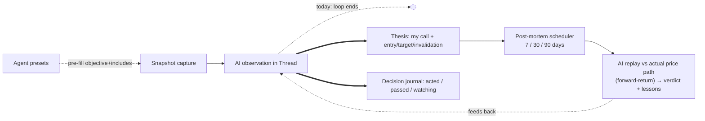
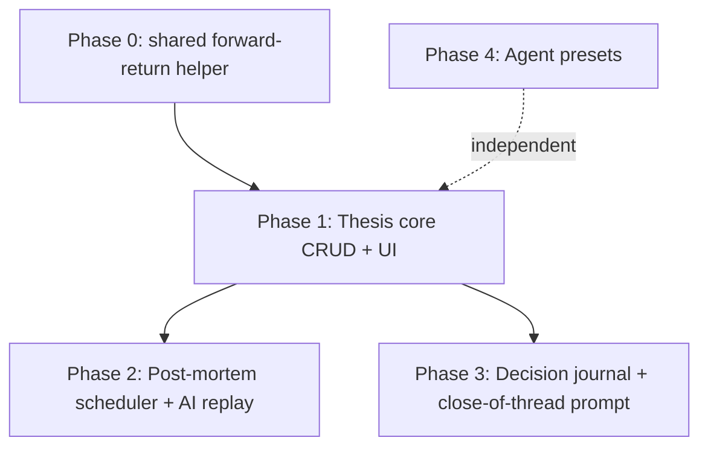

# M11 — "Second Brain" (the decision loop)

## Context

The app is a mature observational trading dashboard (M1→M12 shipped). Its core loop today is **capture market snapshot → AI observation → … nothing**. The system records what the market looked like and what the AI thought, but it never captures *what you decided* or *whether the call was right*. The "decide → review" half of the loop is missing.

This is exactly the milestone the design spec planned as **§16 #11 "Second brain"** (thesis objects, decision-journal close-of-thread prompt, post-mortem scheduler, agent presets) but which was skipped (CLAUDE.md: "there is no M11"). Building it closes the loop and turns a one-shot consultant into a system that learns from its own track record.

The objective forward-return machinery this needs **already exists** in `apps/analytics/services/leaderboard.py` (`_forward_return_pct`, `_nearest_bar_close`, correlating an `AIRun` against `OHLCBar` rows at capture vs capture+N hours). Structured AI output already exists (`apps/ai/providers/claude_structured.run_structured` + the `ObservationReport`/`Signal` Pydantic pattern in `apps/observer/schemas.py`). Scheduling already exists (beat entries in `config/celery.py`, the `evaluate_triggers`/`poll_open_batches` poller pattern). We reuse all three.

## Phasing (each phase independently shippable; 1→2 are the flagship)

---

## Phase 0 — Extract the shared forward-return helper

`apps/analytics/services/leaderboard.py` has private `_forward_return_pct(ticker, at, hours)` and `_nearest_bar_close(ticker, at)`. Post-mortems need the same logic plus a richer price-path summary for the AI prompt.

**New file `backend/apps/market/returns.py`:**
- `nearest_bar_close(ticker, at) -> float | None` — moved verbatim from leaderboard.
- `forward_return_pct(ticker, start, end) -> float | None` — generalize `_forward_return_pct` to take an explicit `end` datetime instead of `hours` (compute % between nearest-bar-close at `start` and at `end`).
- `price_path_summary(ticker, start, end) -> dict` — returns `{start_close, end_close, return_pct, max_high, min_low, bars}` by aggregating `OHLCBar` rows in `[start, end]` (`OHLCBar` is indexed `(ticker, timeframe, ts DESC)`). Used to give the AI the actual price action, not just endpoints.

**Edit `leaderboard.py`** to import `nearest_bar_close` + `forward_return_pct` from the new module and delete its private copies (keep `provider_leaderboard`'s `_forward_return_pct(ticker, at, hours)` call site working by passing `at + timedelta(hours=hours)` as `end`). Verify `apps/analytics/tests/` still passes.

---

## Phase 1 — Thesis core (the object you're tracking)

**New Django app `apps.thesis`** (follow the "Adding a Django app" recipe in CLAUDE.md): `__init__.py`, `apps.py` (`name="apps.thesis"`, `label="thesis"`), `models.py`, `serializers.py`, `views.py`, `urls.py`, `migrations/`, `tests/`.

**`models.py` — `Thesis`:**
- `title` (CharField), `ticker` (CharField, `.upper()` in `save()` like `WatchlistSymbol`), `direction` (`bullish|bearish|neutral`), `rationale` (TextField).
- `conviction` (PositiveSmallIntegerField 1–5, default 3).
- `entry_price`, `target_price`, `invalidation_price` (DecimalField, null=True) — `entry_price` defaults to the snapshot's primary-ticker last price if available, else null.
- `horizon_days` (IntegerField, default 30).
- `status` (`open|closed_win|closed_loss|closed_scratch|invalidated`, default `open`).
- `profile` FK→`profiles.TradingProfile` (null, `SET_NULL`), `thread` FK→`threads.Thread` (null, `SET_NULL`, the source thread), `snapshot` FK→`snapshots.Snapshot` (null, `SET_NULL`, market state at open), `review_thread` FK→`threads.Thread` (null, `SET_NULL`, where post-mortems post).
- `opened_at` (default `timezone.now`), `closed_at` (null), `close_note` (TextField blank), `created_at`/`updated_at`. Index on `(status, -opened_at)`.

**Wiring:** add `"apps.thesis"` to `INSTALLED_APPS` (`config/settings/base.py`); add `path("api/", include("apps.thesis.urls"))` to `config/urls.py` **after** the specific `/api/<name>/` prefixes (the router registers `theses`/`journal`, so generic `/api/` is safe). Add `THESIS_POSTMORTEM_HORIZONS = [7, 30, 90]` to `base.py`.

**`views.py` — `ThesisViewSet`** (full `ModelViewSet`, mirror `ThreadViewSet` style at `apps/threads/views.py`):
- `ThesisSerializer` nests read-only `postmortems` (Phase 2) and exposes the FK ids.
- `@action POST theses/<id>/close/` body `{status, close_note}` → set `status`/`closed_at`/`close_note`.
- `@action POST theses/<id>/run-postmortem/` (Phase 2 wires the body) — exists as stub returning 202 in Phase 1.

**Create-from-source:** `ThesisViewSet.create()` accepts optional `thread_id`/`snapshot_id`; if a snapshot is given, default `entry_price` from its primary quote (reuse the `_primary_ticker` idea — first key of the first `quotes` section). Phase 2's `schedule_postmortems(thesis)` is called here once it exists.

**Frontend:**
- `frontend/src/api/thesis.ts` + `frontend/src/hooks/useTheses.ts` (TanStack Query; mirror `useAnalytics.ts` + `apiGet/apiPost/apiPatch` from `api/client.ts`).
- `frontend/src/pages/ThesesPage.tsx` — list, grouped open vs closed, verdict/status badges; uses `Skeleton`/`EmptyState` primitives.
- `frontend/src/pages/ThesisDetailPage.tsx` — rationale, entry/target/invalidation, links to source thread/snapshot, **post-mortem timeline** (Phase 2 cards), Close button.
- Routes in `frontend/src/router.tsx`: `theses` (crumb "Theses") and `theses/:id` (crumb fn). Add `["/theses", "Theses", …]` to the `TRADING` array in `SideNav.tsx`. Add `j: { path: "/theses", label: "Theses" }` to `SHORTCUTS` in `useKeyboardShortcuts.ts` (`j` is free). Add a `go-theses` Cmd-K command in `AppLayout`'s `useDefaultCommands()`.
- In `ThreadDetailPage.tsx`: a **"New thesis from this"** button that opens a small form (title/direction/conviction/target/invalidation) prefilled with the thread's profile + pinned snapshot, POSTing to `/api/theses/`.

---

## Phase 2 — Post-mortem scheduler + AI replay (closes the loop)

**`models.py` — `PostMortem`:**
- `thesis` FK (CASCADE, `related_name="postmortems"`), `horizon_days` (int, one of the configured horizons), `due_at` (DateTime), `status` (`scheduled|done|failed|skipped`, default `scheduled`).
- `forward_return_pct` (FloatField null), `verdict` (`correct|incorrect|mixed|inconclusive`, blank), `report` (JSONField default dict), `message` FK→`threads.Message` (null, the posted review message), `created_at`/`completed_at`. `UniqueConstraint(thesis, horizon_days)`.

**`schemas.py` — `PostMortemReport`** (Pydantic, mirror `apps/observer/schemas.py`): `summary: str (max 1200)`, `what_worked: list[str]`, `what_missed: list[str]`, `lessons: list[str]`, `would_repeat: bool`, `narrative_verdict: Literal["correct","incorrect","mixed","inconclusive"]`.

**`services/postmortem.py`:**
- `schedule_postmortems(thesis)` — `get_or_create` a `PostMortem` per horizon in `settings.THESIS_POSTMORTEM_HORIZONS` with `due_at = thesis.opened_at + timedelta(days=d)`. Called from `ThesisViewSet.create()`.
- `objective_verdict(thesis, fwd_pct) -> str` — **deterministic, no AI**: `None`→`inconclusive`; `neutral`→`correct` if `|fwd|<=DEADZONE` else `incorrect`; else sign-adjust by direction and grade `correct`/`incorrect`/`mixed` against a `DEADZONE` (1.0%). This guarantees the loop closes even with no AI key / cost cap hit.
- `run_postmortem(pm_id)`:
  1. Load `pm` + `thesis`. Compute `fwd = forward_return_pct(thesis.ticker, thesis.opened_at, pm.due_at)` and `path = price_path_summary(...)` (Phase 0). Set `pm.forward_return_pct`, `pm.verdict = objective_verdict(thesis, fwd)`.
  2. Resolve provider/model: `thesis.profile.default_provider/model` else first enabled `ProviderConfig` (router precedence #4). Run `check_daily_cap`/`check_monthly_cap` (`apps/ai/cost.py`) like `apps/observer/services/run.py` does.
  3. **Best-effort AI narrative:** if provider is `claude` and caps OK → `run_structured(PostMortemReport, system=…, user=<thesis + entry/target + price path summary + fwd return>)`; store `pm.report = report.model_dump()`. Post an assistant `Message` (status `done`) into the thesis's review thread (via `get_or_create_review_thread`, mirroring `apps/observer/services/threads.get_or_create_observer_thread`) and link `pm.message`. On non-Claude / capped / error: leave `report={}` (objective verdict + return still recorded) — degrade gracefully, never raise out of the runner.
  4. `pm.status="done"`, `completed_at=now`, save. Create a `Notification` (reuse existing kinds, or add `"postmortem"` to `Notification.KIND_CHOICES` in `apps/observer/models.py`) and broadcast on `user.anonymous.notifications` via the shared `group_broadcast` helper.

**`tasks.py`:** `@shared_task(name="thesis.run_postmortem")` wrapping `run_postmortem`, and `@shared_task(name="thesis.run_due_postmortems")` that selects `PostMortem.objects.filter(status="scheduled", due_at__lte=now())` and `.delay()`s each (mirror `evaluate_triggers`).

**Beat + discovery wiring in `config/celery.py`:** add `"apps.thesis"` to the `autodiscover_tasks([...])` list, and add a `beat_schedule` entry `"run-due-postmortems": {"task": "thesis.run_due_postmortems", "schedule": 300.0}` (mirror `poll-open-observer-batches`).

**Run-now:** finish `POST theses/<id>/run-postmortem/` → `.delay` an immediate run (create an ad-hoc `PostMortem` row for the elapsed horizon if none is due yet) and return 202. Lets the user replay without waiting days (and is how the E2E/manual test exercises it).

**Frontend:** post-mortem cards on `ThesisDetailPage` — verdict badge, forward-return %, AI summary + lessons, "Run now" button. Add `usePostmortems`/mutation to `useTheses.ts`.

---

## Phase 3 — Decision journal + close-of-thread prompt

**`models.py` — `DecisionJournalEntry`:** `thread` FK→`threads.Thread` (CASCADE, `related_name="journal_entries"`), `thesis` FK (null, `SET_NULL`), `snapshot` FK (null, `SET_NULL`), `decision` (`acted|passed|watching|hedged`), `note` (TextField), `created_at`.

**`views.py` — `JournalEntryViewSet`** registered as `journal` on the thesis router (`/api/journal/`): create + list (filter by `?thread=<id>`). Keeping it in `apps.thesis` (not `threads`) avoids a `threads→thesis` import cycle — `thesis` already imports `threads`.

**Frontend — `ThreadDetailPage.tsx`:** a **"Close & journal"** panel (use the existing dialog/`Toasts` primitives). It POSTs a `DecisionJournalEntry` with the chosen decision + note, prefilled `thread_id`/`snapshot_id`, and offers **"Promote to thesis"** (reuses Phase 1's create form, linking the new `Thesis` back via `thesis_id`). Show existing journal entries inline on the thread. `useJournal` hook in `frontend/src/hooks/`.

---

## Phase 4 — Agent presets (reusable capture stances)

Presets are **capture templates** — they pre-fill the snapshot composer's objective + section includes (and optional structured flag). They compose with the active profile's `style` (which remains the system prompt), so this **does not touch `_build_request` or the provider abstraction** — the objective already leads the AI user message via `serialize_for_ai`. Lives in `apps.profiles` (preset = profile-adjacent config, alongside `TradingProfile`/`Watchlist`).

**`apps/profiles/models.py` — `AgentPreset`:** `name`, `slug` (unique), `description`, `objective_template` (TextField), `default_includes` (JSONField), `structured` (Bool default False), `builtin` (Bool default False), `active` (Bool default True), `created_at`/`updated_at`.

**Data migration** seeding 4 builtins (`builtin=True`):
- `earnings-prep` — includes `quotes/ohlc/news/chain`; objective: prep for upcoming earnings (consensus from news, implied move from chain, key levels, beat/miss scenarios).
- `devils-advocate` — includes `quotes/positions/ohlc`; objective: argue the strongest bear case against current positions/watchlist + what invalidates the bull thesis.
- `pre-trade-bias-check` — includes `quotes/ohlc/breadth`; objective: name cognitive biases in the setup, state the base rate, give go/no-go with conditions.
- `triage-pass` — includes `quotes/positions/breadth/news`; objective: rank what needs attention now across watchlist + positions, most-urgent-first with one-line whys.

**API:** `AgentPresetViewSet` (`ModelViewSet`) added to `apps/profiles/urls.py` as `presets` (`/api/presets/`). Mirror existing profiles serializer/view style.

**Frontend:** `frontend/src/api/presets.ts` + `useAgentPresets.ts`. In `SnapshotComposerPage.tsx`, add a preset dropdown that, on select, sets section checkboxes from `default_includes` and fills the objective textarea from `objective_template`. Add a small management section to `ProfilesPage.tsx` (list/create/edit/delete; builtins editable but flagged).

---

## Files at a glance

**New backend:** `apps/market/returns.py`; whole `apps/thesis/` app (`models.py`, `schemas.py`, `serializers.py`, `views.py`, `urls.py`, `services/postmortem.py`, `services/threads.py`, `tasks.py`, `migrations/`, `tests/`).
**Edited backend:** `apps/analytics/services/leaderboard.py` (import shared helper), `config/settings/base.py` (INSTALLED_APPS + horizons), `config/urls.py` (include), `config/celery.py` (autodiscover + beat), `apps/observer/models.py` (optional `postmortem` notification kind), `apps/profiles/{models,serializers,views,urls}.py` + migration (Phase 4).
**New frontend:** `api/thesis.ts`, `api/presets.ts`, `hooks/useTheses.ts`, `hooks/useJournal.ts`, `hooks/useAgentPresets.ts`, `pages/ThesesPage.tsx`, `pages/ThesisDetailPage.tsx`.
**Edited frontend:** `router.tsx`, `components/layout/SideNav.tsx`, `hooks/useKeyboardShortcuts.ts`, `components/layout/AppLayout.tsx` (Cmd-K), `pages/ThreadDetailPage.tsx`, `pages/SnapshotComposerPage.tsx`, `pages/ProfilesPage.tsx`.

## Verification

- **Migrations:** `make makemigrations && make migrate` — confirm `apps.thesis` initial + profiles preset + seed data migration apply on an empty DB.
- **Backend unit tests** (`apps/thesis/tests/`, parametrized per CLAUDE.md): `objective_verdict` truth table (bullish/bearish/neutral × up/down/flat/none → verdict); `schedule_postmortems` creates one row per horizon with correct `due_at`; `run_due_postmortems` selects only `scheduled & due`; `forward_return_pct`/`price_path_summary` over seeded `OHLCBar` rows; `run_postmortem` degrades (no Claude key → objective verdict recorded, `report={}`, no raise). Run AI-path tests with the structured provider mocked (do **not** set `MOCK_EXTERNAL` on the dev stack — see CLAUDE.md).
- **API tests:** create thesis (auto-schedules post-mortems), close, run-postmortem (202 + row), journal create/list filter, presets CRUD + builtins seeded.
- **Analytics regression:** existing `apps/analytics/tests` still green after the `leaderboard.py` refactor.
- **`make check`** (lint + ty + pytest + vitest).
- **Manual UI** via `make dev`: capture a snapshot using the `triage-pass` preset; open a thread; "New thesis from this"; on the thesis page click **Run now** and confirm a post-mortem card renders with a verdict + forward-return (seed an `OHLCBar` or use mock data); "Close & journal" a thread and confirm the entry + "Promote to thesis" flow.
- **Docs (repo convention):** add a short design addendum `docs/superpowers/specs/2026-05-25-m11-second-brain-design.md`, flip spec §16 #11 to implemented, and drop a plan note under `docs/superpowers/plans/`.

